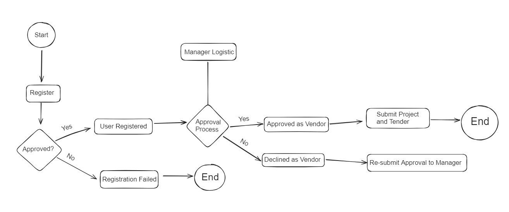
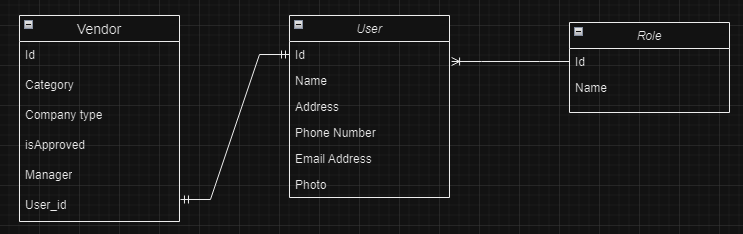

Flow dimulai saat User atau company mendaftarkan diri ke aplikasinya dengan memasukkan data 

1. Nama Perusahaan
2. Alamat Perusahaan
3. Nomor Telepon Perusahaan
4. Email Perusahaan
5. Foto atau Logo Perusahaan

Setelah mengisi data-data dan melakukan registrasi, ada pengecekan oleh admin apakah registrasi disetujui atau tidak, jika disetujui maka akun akan berhasil dibuat, namun jika gagal
maka proses selesai dan user harus mendaftar ulang jika ingin memiliki akun

User yang telah terdaftar maka bisa melakukan pengajuan untuk menjadi vendor dengan mengisi form pengajuan yang berisikan mengenai data - data bidang usaha dan juga jenis perusahaan

Setelah data - data telah terisi dan dikirim maka akan dilakukan pengecekan oleh manager logistic apakah akan disetujui atau ditolak

User yang disetujui menjadi Vendor bisa melakukan submit untuk project dan tender nya, sedangkan user yang tidak disetujui jika masih ingin menjadi vendor, maka harus mengisi ulang form pengajuannya

Setelah project dan tender berhasil di submit, Vendor bisa melihat status project dan tender yang telah di submit, setelah itu proses selesai

Untuk ERD nya ada 3 tabel utama yaitu user, vendor, dan role

User mencakup User perusahaan, admin, dan juga Manager Logistic

User memiliki relasi many to one ke tabel role dimana 1 user hanya bisa memiliki 1 role, dan 1 role bisa dimiliki banyak user

Role yang tersedia ada 3 yaitu sebagai user atau konsumen, Admin untuk menyetujui registrasi akun, dan Manager Logistic untuk mereview persetujuan menjadi vendor

Vendor sendiri memiliki 3 atribut yaitu id vendor, bidang usaha perusahaan, jenis perusahaan, apakah dia di setujui menjadi vendor, manager yang mereview untuk menjadi vendor, dan juga atribut dari user yang masuk ke dalam user id dan memiliki relasi one to one terhadap user dimana 1 user hanya bisa menjadi 1 vendor